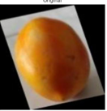

# 🍅🥔 Tomato & Potato Disease Detection using Vision Transformer (ViT)

This project implements a **Vision Transformer (ViT)** model to classify **tomatoes and potatoes as either healthy or diseased**. Trained on curated Kaggle datasets, it achieves **97.45% accuracy** and includes **Grad-CAM visualizations** to explain model predictions. Designed for **local deployment**, the app offers a user-friendly interface via Streamlit or Flask.

---

## 🚀 Features

- ✅ Classifies images into:
  - **Tomato - Healthy**
  - **Tomato - Diseased**
  - **Potato - Healthy**
  - **Potato - Diseased**
- 🧠 Uses **Vision Transformer (ViT)** for high-performance image classification
- 🎯 Achieves **97.45% accuracy** on validation set
- 🔍 Includes **Grad-CAM** visualizations for explainable AI (XAI)
- 💻 Locally deployable with a web interface

---

## 🧠 Model Overview

- **Architecture:** Vision Transformer (ViT)  
- **Framework:** PyTorch (or TensorFlow, update as needed)  
- **Input Resolution:** 224×224 RGB images  
- **Training Techniques:**  
  - Data augmentation  
  - Dropout & regularization  
  - Learning rate scheduling  
  - Early stopping  

---

## 🔎 Explainable AI with Grad-CAM

This project uses **Grad-CAM** to provide **heatmaps** that show which parts of the image influenced the model's decision.

🖼️ Example:

| Original Image | Grad-CAM Heatmap |
|----------------|------------------|
|  |  |

> Grad-CAM allows users to **see what the model is "looking at"** when making predictions, improving trust and interpretability.

---

## 📊 Dataset Information

### 1. [Potato Crop Disease and Health Dataset](https://www.kaggle.com/datasets/shuvokumarbasak4004/potato-crop-disease-and-health-dataset)  
- High-quality potato images, labeled healthy/diseased  
- ~1,558 images, various lighting conditions and angles

### 2. [Tomatoes Dataset](https://www.kaggle.com/datasets/enalis/tomatoes-dataset)  
- Tomato images with visual conditions suitable for binary classification (healthy/diseased)  
- Folder-structured for easy preprocessing

---

